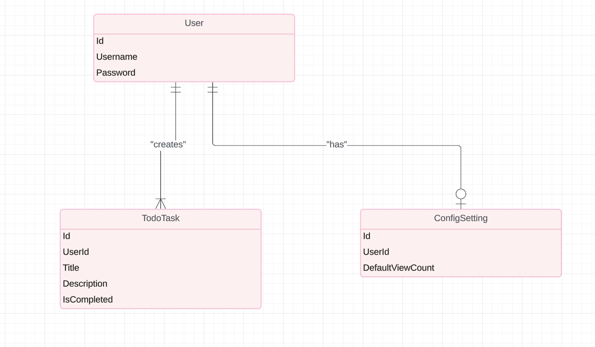

# Vite React App

This project is a modern React application bootstrapped with Vite. It includes features such as Mantine UI components for styling and aims to provide a seamless development experience with fast rebuilds and a lightweight setup.

## Getting Started

These instructions will get you a copy of the project up and running on your local machine for development and testing purposes.

### Prerequisites

What things you need to install the software and how to install them:

```bash
node.js - Download and install from [Node.js website](https://nodejs.org/)
```
